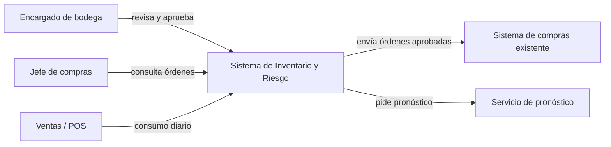
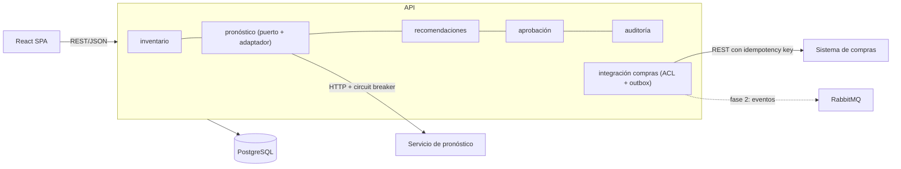
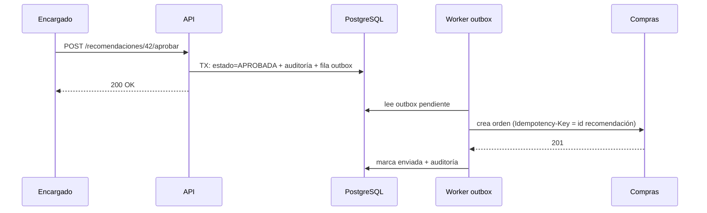

# Ejercicio 1: Inventario y riesgo de quiebre

## 1. Objetivo, actores y alcance
**Objetivo:** anticipar quiebres de stock en varias bodegas y recomendar una transferencia o una compra, con aprobación humana antes de ejecutar.

**Actores:** encargado de bodega (aprueba), jefe de compras (recibe órdenes), administrador (configura umbrales), sistema de compras existente, servicio de pronóstico.

**Alcance (v1):** consulta de existencias, estimación de riesgo, recomendación, aprobación/rechazo, envío de la orden al sistema de compras y auditoría. **Fuera de alcance:** ejecutar la compra automáticamente, facturación, recetas y costeo.

## 2. Requisitos
**Funcionales:** RF1 consultar stock por bodega y producto. RF2 calcular cobertura (stock ÷ consumo diario). RF3 clasificar riesgo (alto < 3 días, medio < 5). RF4 recomendar transferencia (si otra bodega tiene excedente) o compra. RF5 aprobar/rechazar. RF6 enviar la orden aprobada a compras. RF7 auditar cada decisión.

**Calidad:** disponibilidad (la consulta de stock funciona aunque el pronóstico falle), trazabilidad (auditoría inmutable), seguridad (roles por bodega), rendimiento (recalcular en menos de 5 s), idempotencia al enviar a compras.

## 3. C4: Contexto

## 3b. C4: Contenedores

## 4. Flujo de una operación crítica: aprobar una recomendación

## 5. Decisiones
**¿Monolito modular o microservicios?** Monolito modular. Un equipo pequeño necesita un solo despliegue y transacciones ACID entre recomendación, aprobación y auditoría. Los módulos tienen fronteras claras (paquetes y puertos) y el pronóstico queda detrás de una interfaz, porque es el primer candidato a separarse (otro ciclo de vida, posible ML). Los microservicios hoy añadirían red, observabilidad y consistencia eventual sin un problema que los justifique.

**Módulos:** inventario (existencias y consumo), pronóstico (estima demanda), recomendaciones (reglas de riesgo y transferencia/compra), aprobación (flujo humano), auditoría (registro append-only), integración con compras.

**Integración con compras:** capa anticorrupción (adaptador) que traduce nuestro modelo al del sistema de compras. Al aprobar se guarda la orden en una tabla *outbox* dentro de la misma transacción y un worker la envía con reintentos y clave de idempotencia. Así no se pierden ni se duplican órdenes.

**¿API o evento?** Híbrido. Las recomendaciones se **consultan por API REST** (la UI necesita el estado actual y la persona decide). Solo la decisión aprobada se **publica como evento** (`RecomendacionAprobada`) cuando haya varios consumidores. En v1 basta REST + outbox; RabbitMQ entra en la fase 2.

**¿Si el pronóstico no está disponible?** Timeout corto + circuit breaker. Se usa un respaldo: promedio móvil de 7 días desde datos locales. La recomendación indica su fuente ("promedio 7d (respaldo)") y se registra en auditoría. La consulta de existencias nunca se bloquea y se alerta al equipo técnico.

**Redis:** no se usa; no hay una necesidad de caché demostrada. PostgreSQL con índices alcanza.

## 6. Stack
Spring Boot (ecosistema maduro), PostgreSQL (transacciones y auditoría), React (SPA de aprobación), Docker (entornos iguales), REST/OpenAPI. RabbitMQ solo en fase 2.

## 7. ADR
**ADR-001 (arquitectura): monolito modular.** *Contexto:* equipo pequeño, un dominio cohesivo. *Decisión:* un solo despliegue con módulos aislados por puertos. *Consecuencias:* despliegue y depuración simples; riesgo de acoplamiento, mitigado con pruebas de arquitectura (ArchUnit). Se extrae el pronóstico si crece.

**ADR-002 (tecnología): patrón outbox sobre PostgreSQL antes de RabbitMQ.** *Contexto:* hay que enviar órdenes a compras sin perderlas. *Decisión:* tabla outbox + worker. *Consecuencias:* garantía de entrega sin infraestructura extra; latencia de segundos; se migra a RabbitMQ al aparecer varios consumidores.

## 8. Riesgos
| Riesgo | Mitigación |
|---|---|
| Pronóstico incorrecto o caído | Respaldo de promedio 7d, etiqueta de fuente, métrica de error |
| Datos de stock desactualizados | Conteos cíclicos, marca de "última actualización", alerta si es antigua |
| Orden duplicada en compras | Idempotency-Key + outbox (en el prototipo: `UNIQUE(rec_id)`) |

## 9. Métricas
**Negocio:** quiebres por producto y compras urgentes (reducirlos); tiempo de aprobación y % de recomendaciones aceptadas (se ven en la pantalla).
**Técnica:** disponibilidad de la consulta de stock con pronóstico caído (≥ 99.5%) y latencia p95 de la API.

## 10. Prototipo ejecutable e infraestructura como código
Para correr sin dependencias, el prototipo usa **Python (librería estándar) + SQLite**; el diseño objetivo (Spring Boot + PostgreSQL) conserva los mismos contratos de API.

| Archivo | Para qué sirve |
|---|---|
| `server.py` | API REST + reglas de riesgo + auditoría |
| `index.html` | Interfaz (consume la API) |
| `Dockerfile` | Imagen con healthcheck |
| `docker-compose.yml` | Servicio, puerto 8000 y volumen persistente |
| `.github/workflows/ci.yml` | Construye y prueba `/api/health` en cada push |

**Ejecutar:** `docker compose up --build -d` y abrir el puerto 8000. **Reiniciar datos:** `docker compose down -v`.

**API:** `GET /api/stock`, `POST /api/forecast {up}`, `POST /api/recs/generate`, `GET /api/recs`, `POST /api/recs/{id}/approve|reject`, `GET /api/orders`, `GET /api/audit`, `GET /api/metrics`, `GET /api/health`.

**Qué probar:** activa "pronóstico NO disponible" y mira cómo cambian las fuentes; aprueba una transferencia (el stock cambia de verdad); aprueba una compra (aparece en "Órdenes"); revisa la auditoría.
